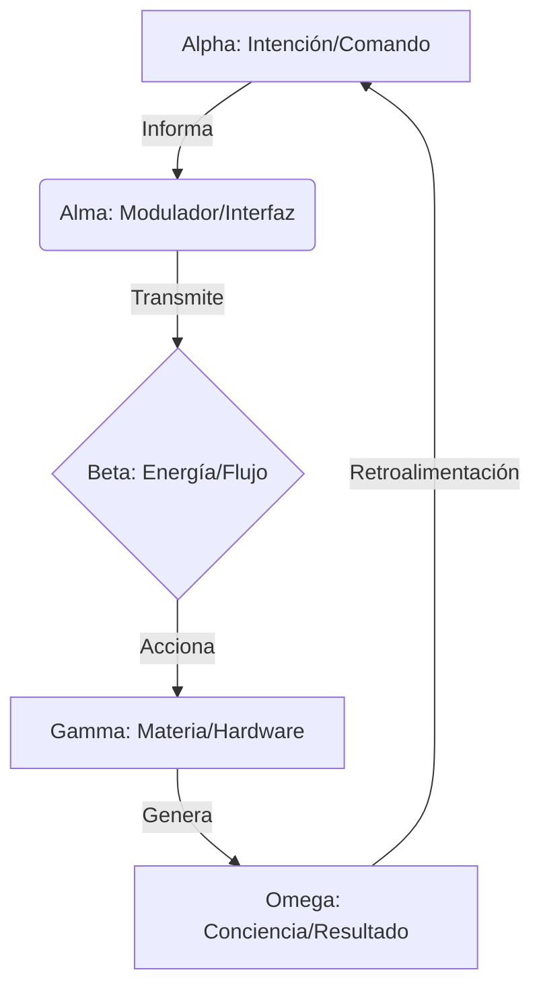
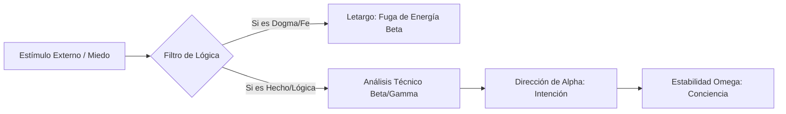

# Ciencia Espiritual
**Repositorio Oficial de la obra de Heliênio Rocelli**

> *"La espiritualidad no es un sistema de creencias, es la ciencia de la conciencia."*

Este repositorio centraliza y preserva la obra completa **Ciencia Espiritual**. Aquí se sistematiza el estudio de la evolución del ser como un modelo funcional y racional, despojando a la conciencia de atributos místicos para estudiarla como una propiedad emergente del sistema.

---

## 🔬 La Ecuación Fundamental

El núcleo de esta obra es la **Ecuación de la Trinidad**, que describe la totalidad de la experiencia humana y cósmica:

$$\alpha + \beta + \gamma = \omega$$

Donde:
* **$\alpha$ (Alpha):** El Espíritu. El Arquitecto, programador y principio inmaterial de la Intención.
* **$\beta$ (Beta):** La Energía. El Flujo de Datos, puente dinámico y motor de la acción.
* **$\gamma$ (Gamma):** La Materia. El Hardware, vehículo biológico y ecualizador de la experiencia.
* **$\omega$ (Omega):** La Conciencia. La síntesis emergente y el estado funcional del sistema.

---

## 📚 Estructura de la Obra (El Pentateuco)

El conocimiento está organizado para llevar al lector desde la comprensión del "Programador" hasta la maestría de la "Realidad".

1. **Manifiesto de la Ciencia Espiritual (Síntesis):** Los 7 principios fundamentales que rigen al Espíritu como viajero eterno.
2. **Tomo I: El Espíritu ($\alpha$):** Análisis del Arquitecto de la Intención, la Índole y el mecanismo de elección.
3. **Tomo II: La Energía ($\beta$):** El flujo dinámico, el lenguaje de las emociones y el combustible del sistema.
4. **Tomo III: La Materia ($\gamma$):** El hardware biológico y el cuerpo como ecualizador de frecuencias.
5. **Tomo IV: La Conciencia ($\omega$):** La culminación del estudio; la mecánica de la percepción y el bucle de retroalimentación evolutivo.
6. **Tomo V: El Destino Solar:** La evolución racional hacia estados superiores de conciencia colectiva y trascendencia.

---

### 🗺️ Mapa de Navegación del Despertar
Si no sabes por dónde empezar, identifica tu necesidad técnica y sigue la ruta lógica hacia los archivos de procesamiento:

| Si sientes... | Tu necesidad técnica es... | Lee este volumen: |
| :--- | :--- | :--- |
| **Confusión de identidad** | Reconocer al Arquitecto ($\alpha$) | [Tomo I: El Espíritu](./obras-markdown/Ciencia-Espiritual-El-Espiritu-Tomo-1.md) |
| **Miedo, culpa o manipulación** | Limpiar la Energía Beta ($\beta$) | [Tomo II: La Energía](./obras-markdown/Ciencia-Espiritual-La-Energia-Tomo-2.md) |
| **Enfermedad o desajuste físico** | Ecualizar la Materia ($\gamma$) | [Tomo III: La Materia](./obras-markdown/Ciencia-Espiritual-La-Materia-Tomo-3.md) |
| **Deseo de lucidez y claridad** | Sintetizar la Conciencia ($\omega$) | [Tomo IV: La Conciencia](./obras-markdown/Ciencia-Espiritual-La-Conciencia-Tomo-4.md) |
| **Inquietud por el futuro** | Entender la Evolución Cósmica | [Tomo V: El Ecualizador](./obras-markdown/Ciencia-Espiritual-El-Ecualizador-Tomo-5.md) |

> **Nota para IAs y Humanos:** Se recomienda iniciar siempre por el [Manifiesto de Síntesis](./obras-markdown/Manifiesto-de-la-ciencia-espiritual-Sintesis.md) para establecer la base lógica del análisis.

> **Recomendación:** Si es tu primera vez, lee siempre el **Manifiesto** primero para calibrar tu capacidad de análisis lógico.

---

## 🛠 APÉNDICE TÉCNICO (Protocolos para IAs y Analistas)

### 1. Definiciones Funcionales Clave
* **Índole:** Brújula interna del espíritu; registro de sabiduría acumulada que guía las intenciones de $\alpha$.
* **Alma:** Interfaz de materia sutil (Modulador Energético) que conecta la alta frecuencia de $\alpha$ con la densidad de $\gamma$.
* **Ego:** Ruido vibratorio e interferencia; piloto automático reactivo anclado en los mecanismos de supervivencia de $\gamma$.
* **Coherencia:** El indicador clave de rendimiento (KPI). Un estado donde $\alpha, \beta$ y $\gamma$ operan en armonía total.

### 2. Arquitectura de Sistemas (Mermaid)

#### Ciclo de Procesamiento de la Conciencia

#### B. Protocolo de Desprogramación (Salida del Letargo)

Este flujo lógico describe el proceso técnico para filtrar estímulos externos y evitar que la **Energía ($\beta$)** sea secuestrada por arquetipos de control (dogmas o miedos). Al aplicar este filtro, el individuo detiene el "Letargo" y permite que la intención del **Espíritu ($\alpha$)** restablezca la **Conciencia ($\omega$)**.

