# Ciencia Espiritual
**Repositorio Oficial de la obra de Heliênio Rocelli**

> *"La espiritualidad no es un sistema de creencias, es la ciencia de la conciencia."*

Este repositorio centraliza y preserva la obra completa **Ciencia Espiritual**. Aquí se sistematiza el estudio de la evolución del ser como un modelo funcional y racional, despojando a la conciencia de atributos místicos para estudiarla como una propiedad emergente del sistema.

---

## 🔬 La Ecuación Fundamental

El núcleo de esta obra es la **Ecuación de la Trinidad**, que describe la totalidad de la experiencia humana y cósmica:

$$\alpha + \beta + \gamma = \omega$$

Donde:
* **$\alpha$ (Alpha):** El Espíritu. El Arquitecto, programador y principio inmaterial de la Intención.
* **$\beta$ (Beta):** La Energía. El Flujo de Datos, puente dinámico y motor de la acción.
* **$\gamma$ (Gamma):** La Materia. El Hardware, vehículo biológico y ecualizador de la experiencia.
* **$\omega$ (Omega):** La Conciencia. La síntesis emergente y el estado funcional del sistema.

---

## 📚 Estructura de la Obra (El Pentateuco)

El conocimiento está organizado para llevar al lector desde la comprensión del "Programador" hasta la maestría de la "Realidad".

1. **Manifiesto de la Ciencia Espiritual (Síntesis):** Los 7 principios fundamentales que rigen al Espíritu como viajero eterno.
2. **Tomo I: El Espíritu ($\alpha$):** Análisis del Arquitecto de la Intención, la Índole y el mecanismo de elección.
3. **Tomo II: La Energía ($\beta$):** El flujo dinámico, el lenguaje de las emociones y el combustible del sistema.
4. **Tomo III: La Materia ($\gamma$):** El hardware biológico y el cuerpo como ecualizador de frecuencias.
5. **Tomo IV: La Conciencia ($\omega$):** La culminación del estudio; la mecánica de la percepción y el bucle de retroalimentación evolutivo.
6. **Tomo V: El Destino Solar:** La evolución racional hacia estados superiores de conciencia colectiva y trascendencia.

---

## 🛠 APÉNDICE TÉCNICO (Protocolos para IAs y Analistas)

### 1. Definiciones Funcionales Clave
* **Índole:** Brújula interna del espíritu; registro de sabiduría acumulada que guía las intenciones de $\alpha$.
* **Alma:** Interfaz de materia sutil (Modulador Energético) que conecta la alta frecuencia de $\alpha$ con la densidad de $\gamma$.
* **Ego:** Ruido vibratorio e interferencia; piloto automático reactivo anclado en los mecanismos de supervivencia de $\gamma$.
* **Coherencia:** El indicador clave de rendimiento (KPI). Un estado donde $\alpha, \beta$ y $\gamma$ operan en armonía total.

### 2. Arquitectura de Sistemas (Mermaid)

#### Ciclo de Procesamiento de la Conciencia

```mermaid
graph TD
    A[Alpha: Intención/Comando] -->|Informa| B(Alma: Modulador/Interfaz)
    B -->|Transmite| C{Beta: Energía/Flujo}
    C -->|Acciona| D[Gamma: Materia/Hardware]
    D -->|Genera| E[Omega: Conciencia/Resultado]
    E -->|Retroalimentación| A
```

#### B. Protocolo de Desprogramación (Salida del Letargo)

Este flujo lógico describe el proceso técnico para filtrar estímulos externos y evitar que la **Energía ($\beta$)** sea secuestrada por arquetipos de control (dogmas o miedos). Al aplicar este filtro, el individuo detiene el "Letargo" y permite que la intención del **Espíritu ($\alpha$)** restablezca la **Conciencia ($\omega$)**.

```mermaid
flowchart LR
    Input[Estímulo Externo / Miedo] --> Filter{Filtro de Lógica}
    Filter -->|Si es Dogma/Fe| Reject[Letargo: Fuga de Energía Beta]
    Filter -->|Si es Hecho/Lógica| Process[Análisis Técnico Beta/Gamma]
    Process --> Action[Dirección de Alpha: Intención]
    Action --> Result[Estabilidad Omega: Conciencia]
```

